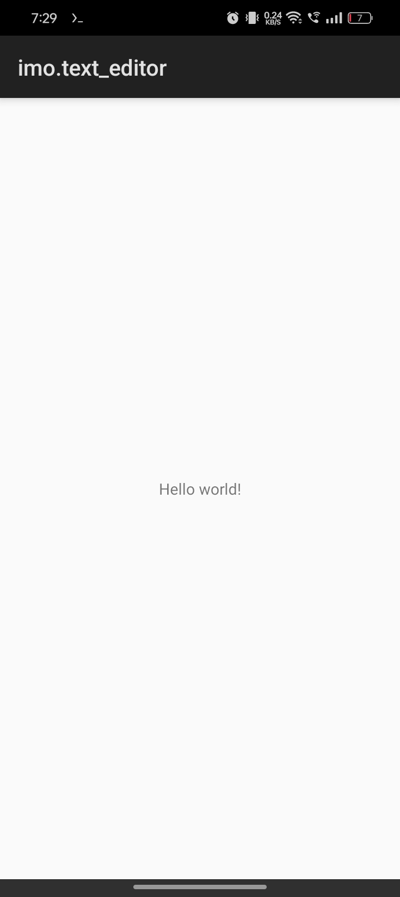

# 30-Days-Of-TextEditor
making an android text editor from scratch in 30 days

  

    
  | D A Y 11 |
  | :--: |

  

Week 1

  
✅✅ setting up  
✅✅ render string as text on canvas  
⬜⬜ tap positioning  
⬜ polish  

 

 Week 2 ⭐

⬜⬜ text wrapping  
⬜🔳 keyboard input  
⬜⬜ scrolling  
⬜ polish  

 Week 3

⬜⬜ scrolling and flinging  
⬜⬜ pinch to zoom  
⬜⬜ horizontal scrolling  
⬜ polish  

Week 4

⬜⬜ text selection with long-press
⬜⬜ selection handles  
⬜⬜ cut, copy, paste  
⬜⬜ file editing  
⬜ CELEBRATE🎉

 

## Screenshots
image 1 is before.  
image 2 is after.

