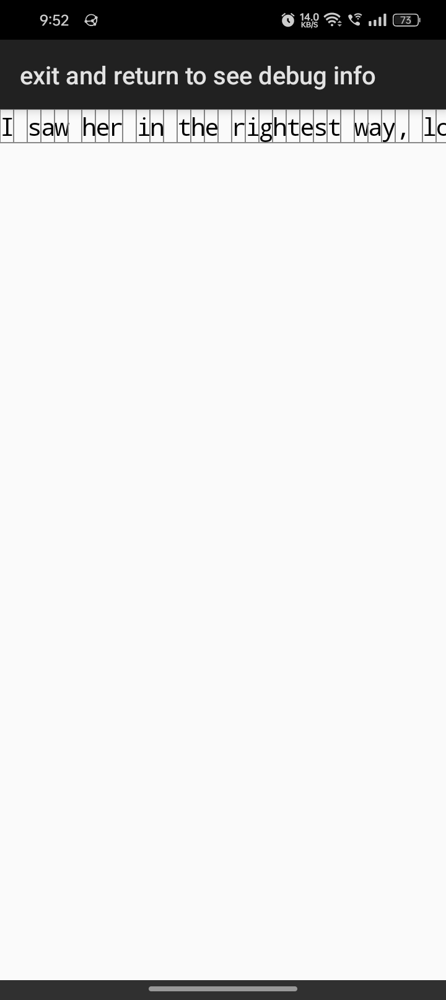

# 30-Days-Of-TextEditor
making an android text editor from scratch in 30 days

  

    
  | D A Y 12 `behind schedule` |
  | :--: |

  

Week 1

  
✅✅ setting up  
✅✅ render string as text on canvas  
❌❌ tap positioning  
❌❌ polish  

 

 Week 2 ⭐

❌❌ text wrapping  
❌❌ keyboard input  
🔳⬜ tap positioning   
⬜⠀⠀ rest

 Week 3

  
⬜⬜ text wrapping  
⬜⬜ keyboard input  
⬜⬜ scrolling  
⬜⠀⠀ rest

Week 4

⬜⬜ scrolling and flinging  
⬜⬜ pinch to zoom  
⬜⬜ horizontal scrolling  
⬜⬜ long press selection  
⬜ CELEBRATE🎉

 

## Screenshots
image 1 is before.  
image 2 is after.

